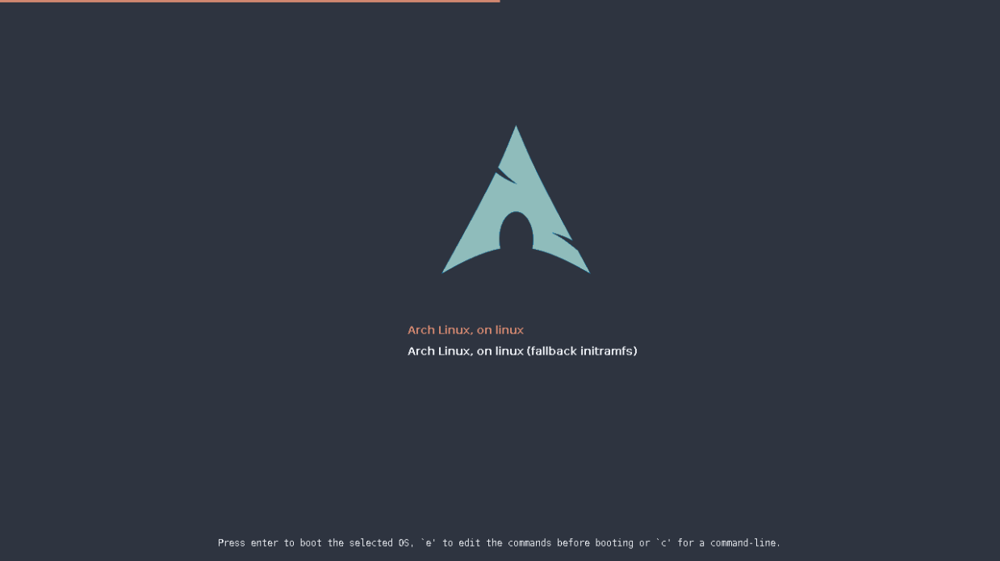

# Arch-Nord theme for the GRUB 2 boot loader

A GRUB 2 theme for Arch Linux based on the arctic, north-bluish Nord color palette.

https://www.nordtheme.com/docs/colors-and-palettes

## Author

Jürg Lempen

## Forked from

The Arch-Silence theme by Filippo Ghibellini

https://github.com/fghibellini/arch-silence

## License

If not explicitly stated otherwise, all the files in this project are distributed under the [GNU General Public License](./COPYING).
